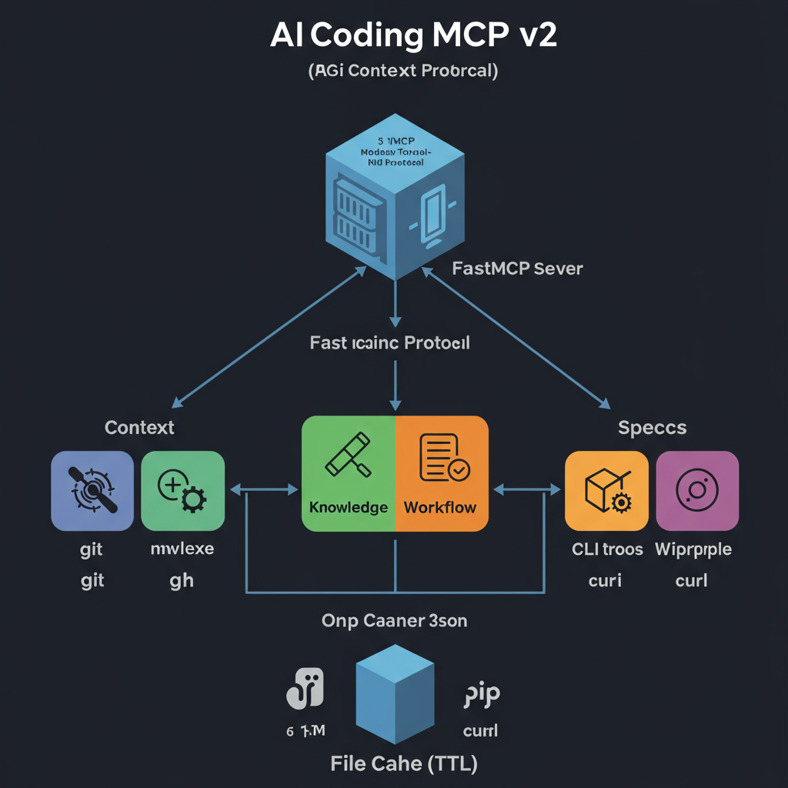
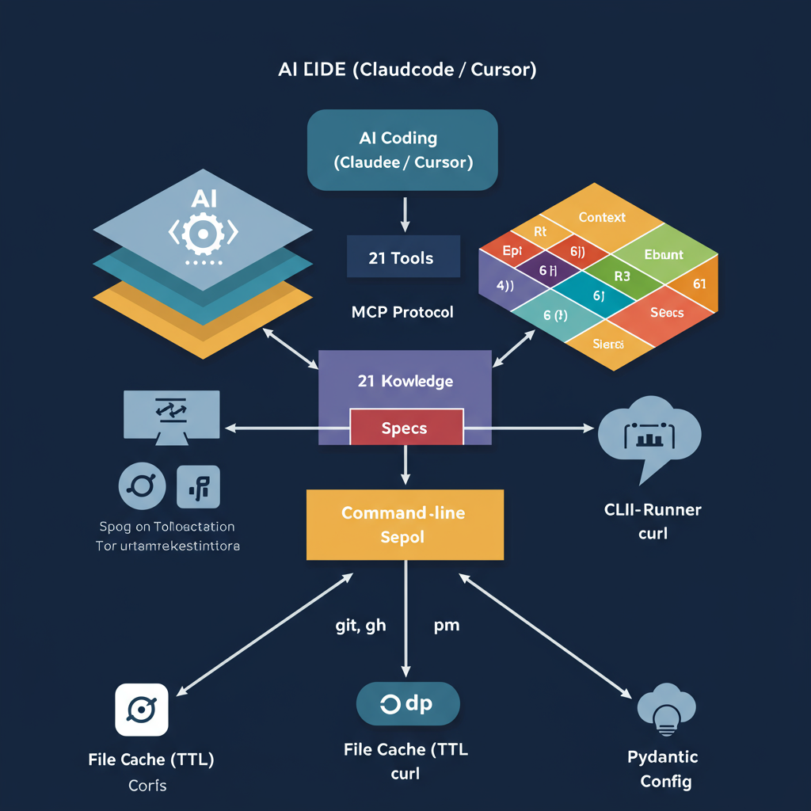

# AI Coding MCP v2

Lightweight MCP server for AI IDEs (Claude Code, Cursor, etc.). Provides 21 tools across 4 modules without LLM wrapping.



## Quick Start

```bash
pip install -r requirements.txt
python server.py
```

## Modules

### Context (4 tools)
- `index_project` - Index project files and extract symbols
- `get_symbol_info` - Look up symbol information
- `get_dependency_graph` - Analyze file dependencies
- `get_project_stats` - Get project statistics

### Knowledge (4 tools)
- `search_docs` - Search documentation (stub)
- `get_package_info` - Query package registries (PyPI/npm)
- `search_code_examples` - Search code examples (stub)
- `check_compatibility` - Check dependency compatibility

### Workflow (6 tools)
- `git_status` - Get git working tree status
- `git_history` - Get commit history
- `git_branch_analysis` - Analyze branches (stub)
- `ci_status` - Check CI status (stub)
- `issue_list` - List GitHub issues (stub)
- `pr_summary` - Get PR summary (stub)

### Specs (6 tools)
- `list_specs` - List specification files
- `get_spec` - Read spec content
- `search_specs` - Search specs
- `create_spec` - Create new spec from template
- `scaffold_project` - Scaffold project from template
- `validate_structure` - Validate directory structure (stub)

## Architecture



- **CLI-first**: All external calls via `git`, `gh`, `pip`, `npm`, `curl`
- **Zero LLM wrapping**: Return structured data, let AI IDE analyze
- **File-based cache**: TTL cache in `~/.cache/ai-coding-mcp/`
- **Pydantic config**: Type-safe configuration

## Project Structure

```
ai-coding-mcp/
├── server.py                    # FastMCP entry, tool registration
├── config.py                    # Pydantic config
├── tools/
│   ├── context/                 # code_indexer, dependency_graph, project_stats
│   ├── knowledge/               # doc_search, package_info, code_search, compatibility
│   ├── workflow/                # git_ops, ci_github
│   └── specs/                   # spec_manager, scaffold, validator
├── utils/
│   ├── cli_runner.py            # Unified CLI executor
│   └── cache.py                 # File-based TTL cache
├── tests/
├── requirements.txt
└── README.md
```

## Testing

```bash
pytest tests/ -v
```

## IDE Configuration

For Claude Code, add to your MCP settings:

```json
{
  "mcpServers": {
    "ai-coding": {
      "command": "python",
      "args": ["server.py"]
    }
  }
}
```

## License

MIT License
